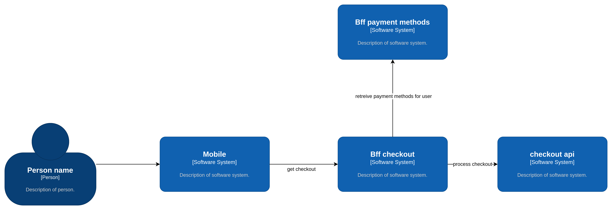

The idea of this repository is show how to work server driven ui and how the Backend for frontends services must work in microservices architecture archiving more confidence, scalability and improve team working dependencies to low levels

Also, the server driven ui help the dev team to unify user experience and user interface, a/b testing using only a bff validation and improves security (returned information is only the needed)
